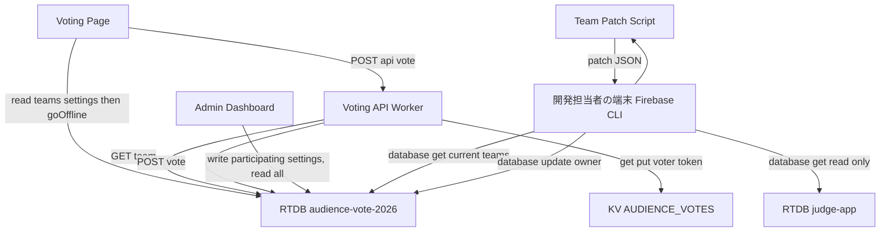
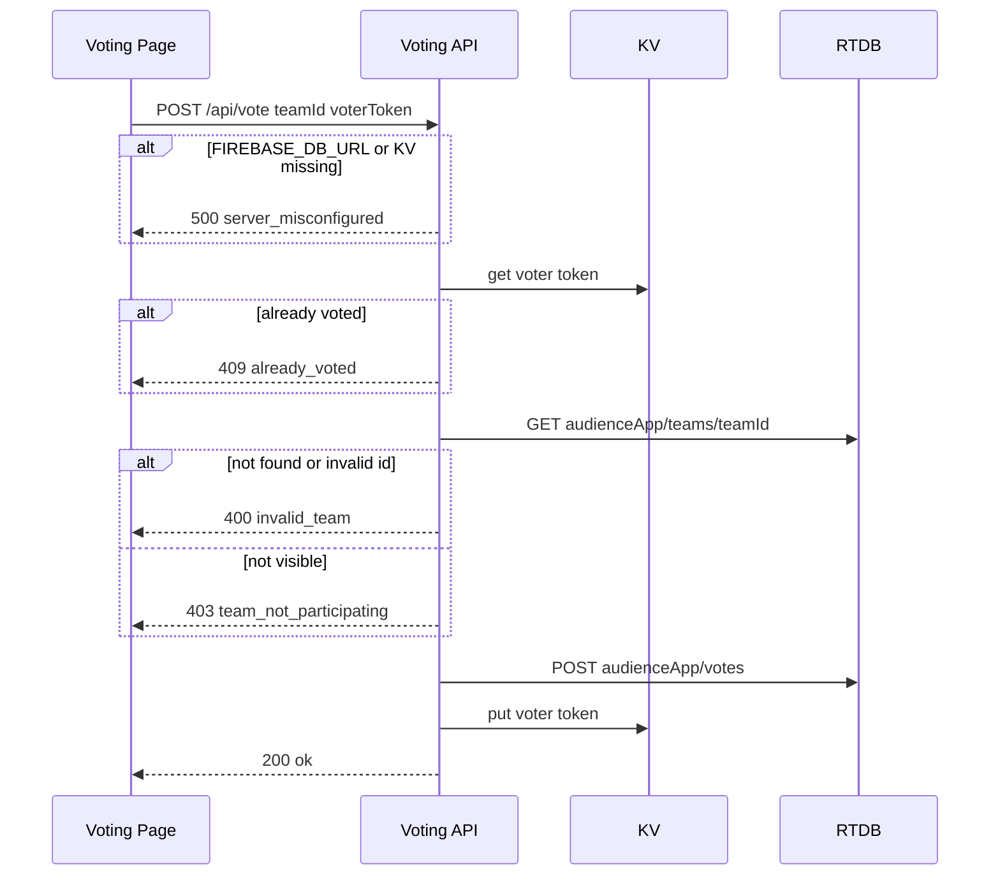
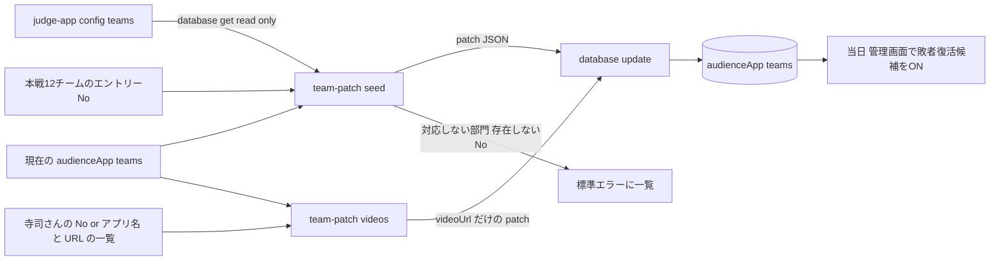

# Design Document

## Overview
本機能は、audience-vote-app の48チームを事前に一括登録し、本戦確定12チームは常に表示、敗者復活候補のチームは当日管理画面で表示・非表示を切り替えられるようにする。チームは審査アプリ（judge-app）のデータから登録スクリプトで生成し、Firebase CLI で投票アプリ専用のDBへ書き込む。紹介動画URLや名称の修正も同じ手順で追記する。あわせて、投票が保存されない・二重投票を防げていない・設定漏れに気づけない、といった本番稼働を妨げる問題を解消する。

**Users**: 開発担当者（照屋さん）が事前登録と情報の追記を行う。運営担当者は当日、管理画面で敗者復活候補の表示切替・受付のON/OFF・集計確認を行う。来場者はQRコードから投票画面を開き、ログインせずに1票を投じる。

**Impact**: 接続先を投票アプリ専用のFirebaseプロジェクト `audience-vote-2026` に切り替える。judge-app は読み取りのみで扱う。管理画面のCSV/Excel取込を廃止する。既存のファイル構成は維持し、配信・設定・データ登録のための最小限のファイルを追加する。

### Goals
- 当日の運用が「敗者復活候補のチェックを入れる」だけで完結する
- 本戦確定チームが、誤操作やデータの不整合があっても投票画面から消えない
- 投票が確実に保存され、無効な投票や二重投票が拒否される。設定漏れはエラーとして表に出る
- 2026/9/12 10:00 の本審査までに、本番環境で確実に動作する

### Non-Goals
- 来場者・管理者のログイン認証
- 管理画面でのチームの追加・削除・名称編集・ファイル取込
- DBへの直接書き込みの防止（requirements の「既知のリスク」で許容済み）
- 投票画面での本戦／敗者復活の見た目の区別、ライブ更新、独自ドメイン、CI/CD、テスト基盤の新設

## Boundary Commitments

### This Spec Owns
- チームのデータ構造（`entryNo`・`finalist`・`participating`・`videoUrl`）と、「表示するかどうか」の判定規則
- 登録スクリプト（初期登録・動画URLの追記・名称の修正のパッチ生成）と、その実行手順
- 管理画面の敗者復活候補の表示切替UI・集計表示、投票画面の絞り込み・並び順・エントリーNoの表示
- `/api/vote` の検証・保存・二重投票防止と、設定漏れ時の挙動
- 投票アプリ専用DB（`audience-vote-2026`）のセキュリティルール
- 配信対象ファイルの制御と、接続値の置き場所
- 手順書（`docs/DEPLOY.md`・`docs/TEAM-DATA.md`・`README.md`）の、上記に関わる記述

### Out of Boundary
- judge-app の値・ルール・コードの変更（読み取り以外の操作は一切しない）
- 部門賞・グランプリなど、オーディエンス賞以外の審査
- 投票受付の停止をWorker側で強制すること（投票画面での無効化のみ。要件8.3）
- 本戦確定チームを非表示にする操作（本仕様では提供しない。必要になった場合は登録スクリプトで区分を変える）

### Allowed Dependencies
- Firebase RTDB（`audience-vote-2026`、`asia-southeast1`）: ブラウザからは compat SDK 10.12.2、Workerからは REST API（認証なし）で使う。Admin SDK・サービスアカウントは使わない
- Cloudflare Workers + Static Assets + KV（`AUDIENCE_VOTES`）
- Firebase CLI（`npx firebase-tools`）: DBのオーナー権限で、登録パッチの書き込み・ルールの反映・judge-app の `/config/teams` の読み取りに使う
- Node.js 24（登録スクリプト。標準ライブラリのみ）

### Revalidation Triggers
- チームのデータ構造、または「表示するかどうか」の判定規則の変更（`app.js`・`admin.js`・`worker.js` の3か所で揃える必要がある）
- `firebase.rules.json` の変更
- `/api/vote` のリクエスト・レスポンスの形の変更
- 配信するファイルの追加・名前変更（`.assetsignore` の許可リストの更新が必要）
- デプロイ先の Cloudflare アカウントの変更（公開URLとKVの作り直しが発生する）

## Architecture

### Existing Architecture Analysis
- ブラウザがFirebase RTDBを直接読み書きし、投票だけを薄いWorker（`/api/vote`）経由にする構成。この構成は維持する
- 実装済み（コミット `265944c`・`fb06b4a`）で活かすもの: 参加フラグの切替UIの骨格、投票画面の絞り込み、Workerの検証と保存
- 実装済みで廃止するもの: CSV/Excel取込（`mergeTeams`・`validateRows`・`readUploadFile`・upload UI・xlsx.js）、匿名認証
- 新たに変える点: 本戦区分とエントリーNo、表示判定の共通化、登録スクリプト、Workerの設定漏れ時の挙動、投票画面の接続の扱い、HTMLエスケープ、配信対象の制御、接続値の置き場所、ルール

### Architecture Pattern & Boundary Map



**Architecture Integration**:
- Selected pattern: ブラウザからDB直結 + 投票だけWorker経由（現行を踏襲）
- Domain/feature boundaries: チームの登録・情報の追記は開発担当者の CLI だけが行う。管理画面が書くのは敗者復活候補の `participating` と `settings` だけ。票を書くのは Worker だけ。judge-app に触れるのは、開発担当者の端末での読み取りコマンドだけ
- 表示判定は `finalist === true || participating === true` に統一し、投票画面・Worker・管理画面（表示中の数）で同じ規則を使う。本戦確定チームは、`participating` の値にかかわらず常に表示される（要件1.2を、データの状態ではなく判定規則で保証する）
- New components rationale: `.assetsignore`（非公開ファイルの配信を止める）、`firebase-config.example.js`（要件11.2）、`firebase.json`（ルールの反映）、`scripts/team-patch.mjs`（要件2・12）、`docs/TEAM-DATA.md`（登録手順）

### Technology Stack

| Layer | Choice / Version | Role in Feature | Notes |
|-------|------------------|-----------------|-------|
| Frontend | Vanilla JS、Firebase compat SDK 10.12.2 | 投票画面・管理画面 | `firebase-auth-compat.js` と xlsx.js の読み込みを削除する |
| Backend | Cloudflare Workers（`worker.js`） | `/api/vote` | Fetch API のみ |
| Data | Firebase RTDB `audience-vote-2026`（`asia-southeast1`、無料プラン） | チーム・票・受付設定 | 同時接続の上限は100。現在はロックモード |
| Data | Cloudflare KV `AUDIENCE_VOTES` | 投票済みの端末トークン | TTLは30日（既存） |
| Tooling | Node.js 24、Firebase CLI 15.x | 登録パッチの生成と書き込み、ルールの反映 | スクリプトは標準ライブラリのみ |
| Infrastructure | Wrangler | デプロイ、secret、KV | デプロイ先アカウントは未確定（Risks参照） |

## File Structure Plan

### Directory Structure
```
audience-vote-app/
├── index.html / app.js          # 投票画面（配信する。2026-09-10 のデザイン刷新版）
├── vote.css                     # 投票画面専用のスタイル（配信する。デザイン刷新で追加）
├── admin.html / admin.js        # 管理画面（配信する）
├── style.css                    # 管理画面のスタイル（配信する）
├── firebase-config.js           # 接続値・入室ID（git管理外・配信する）
├── firebase-config.example.js   # 新規: 接続設定のひな形（配信しない）
├── worker.js                    # Voting API（配信しない）
├── wrangler.jsonc               # Worker設定 + KV binding
├── .assetsignore                # 新規: 配信するファイルの許可リスト
├── .dev.vars                    # ローカル用 FIREBASE_DB_URL（git管理外・配信しない）
├── firebase.json                # 新規: ルール反映の設定（配信しない）
├── firebase.rules.json          # 投票アプリ専用DBのルール（配信しない）
├── scripts/
│   └── team-patch.mjs           # 新規: 登録・動画URL追記・名称修正のパッチを生成
└── docs/
    ├── DEPLOY.md                # デプロイ手順（配信しない）
    └── TEAM-DATA.md             # 新規: チームデータの登録・追記の手順（配信しない）
```
登録作業の中間ファイル（judge-app から読み取ったJSON、現在のチーム一覧、生成したパッチ）は、リポジトリの外（`06.コンテスト/work/`）に置く。

### Modified / New Files
- `app.js` — （デザイン刷新版をベースにする。既存の `escapeHtml`・`safeVideoUrl` を活かす）表示判定を `isVisibleTeam()` に置き換える。部門ごとに `entryNo` の昇順で並べる。「No.{entryNo} {title}」と表示する。動画URLが http(s) でないとき（未設定を含む）は VIDEO リンクの要素自体を出さない。投票データの読み込みを削除する。読み込み後に `firebase.database().goOffline()` する。読み込み失敗時は再読み込みを促す。デモ用の `DEFAULT_TEAMS` に `entryNo`・`finalist` を追加する
- `admin.js` — CSV取込の関連コードをすべて削除する（`makeTeamKey`・`parseParticipatingFlag`・`mergeTeams`・`readUploadFile`・`validateRows`・uploadのハンドラ）。匿名認証を削除する。一度きりの読み込み（`fetchDashboardData`）を、`teams`・`votes`・`settings` の購読に置き換える。集計（オーディエンス賞候補・同票・未判定・順位付きの全体集計・総票数・部門別）と表示切替（本戦一覧・候補のチェックボックス・表示中の数・失敗時に戻す）を、別々の描画関数に分ける。チーム名はエスケープする。`DEFAULT_TEAMS` を `app.js` と揃える
- `admin.html` — アップロード欄（`#upload-panel`）、xlsx.js、`firebase-auth-compat.js` を削除する。「集計」パネル（オーディエンス賞候補・総票数・順位付きの全体集計・部門別）と、「表示切替」パネル（本戦一覧・候補一覧・表示中の数・エラーメッセージの表示欄）に分ける
- `worker.js` — 表示判定を `isVisibleTeam()` にする。`FIREBASE_DB_URL` か `AUDIENCE_VOTES` が欠けていれば500 `server_misconfigured` を返す。メモリ上のフォールバックを削除する。JSONの解析エラーとそれ以外のエラーを区別する
- `firebase.rules.json` — 下の「Data Contracts」のルールに置き換える
- `firebase.json`（新規） — `{ "database": { "rules": "firebase.rules.json" } }`
- `wrangler.jsonc` — `kv_namespaces` に `AUDIENCE_VOTES` を追加する。`FIREBASE_DB_URL` は書かない（secret で渡す）。`assets.not_found_handling: "single-page-application"` を削除する（この画面はクライアント側のルーティングを使わない。SPAの設定のままだと、配信から外したパスや存在しない `firebase-config.js` が `index.html` として200で返る）
- `.assetsignore`（新規） — 許可リスト方式: `*` の後に `!index.html` `!admin.html` `!app.js` `!admin.js` `!style.css` `!vote.css` `!firebase-config.js`（7ファイル）
- `.gitignore` — `firebase-config.js` と `.dev.vars` を追加する。`firebase-config.js` は `git rm --cached` で管理から外す
- `firebase-config.example.js`（新規） — 項目名とプレースホルダーだけを書く（`audienceDemoAdmin` も含む）
- `scripts/team-patch.mjs`（新規） — 下の「Team Patch Script」を参照
- `docs/TEAM-DATA.md`（新規）、`docs/DEPLOY.md`、`README.md` — 接続先、secret、KV、`.assetsignore`、ルールの反映、チームの登録と追記、公開後の確認手順を記載する。README の「CSV/Excel取込フォーマット」の章は削除する

## System Flows

### 投票受付

票の保存に成功してから、KVに投票済みの印を付ける。KVの確認と書き込みはアトミックではないので、同じ端末から同時に2回送ると2票入る可能性がある。これは許容する。

### チームの登録・追記と当日の運用

- パッチはすべて「チームID/項目」を1つのキーにした multi-path の形で、`database:update /audienceApp/teams` によって、書く項目だけを更新する（他の項目を消さない）
- `seed` を再実行しても、既存のチームは `finalist`（と本戦の `participating: true`）以外を書き換えない。当日の切替状態・動画URL・名称の修正が保たれる

## Requirements Traceability

| Requirement | Summary | Components | Interfaces | Flows |
|-------------|---------|------------|------------|-------|
| 1.1 | 各チームの項目を保持 | Team Data Model | Team | - |
| 1.2 | 本戦は常に表示 | Voting Page, Voting API, Admin Dashboard | `isVisibleTeam()` | 投票受付 |
| 1.3, 1.4 | 敗者復活候補の初期値は非表示、未設定は非表示 | Team Patch Script, `isVisibleTeam()` | `seed` | 登録・追記 |
| 2.1, 2.2 | 48チームを登録し、本戦と候補に分ける | Team Patch Script | `seed --finalists` | 登録・追記 |
| 2.3 | 再実行しても重複せず、状態を変えない | Team Patch Script | `seed --current`、チームID `entry-NN` | 登録・追記 |
| 2.4 | judge-app は読み取りのみ | Runbook | `database:get` | 登録・追記 |
| 2.5 | 対応しない部門・存在しないNoを一覧で示す | Team Patch Script | 標準エラーの出力 | 登録・追記 |
| 2.6 | 管理画面に追加・削除・取込を置かない | Admin Dashboard | upload UI の削除 | - |
| 3.1, 3.2, 3.3 | 候補だけ切替、本戦は常に表示と明示、表示中の数 | Admin Dashboard | `renderGlobalResults` | - |
| 3.4, 3.5, 3.6 | 即時反映・保存・失敗時は元に戻す | Admin Dashboard | `.participating-toggle` のハンドラ | - |
| 4.1, 4.2, 4.3 | 表示対象だけを区別なく表示 | Voting Page | `readTeams`、`isVisibleTeam()` | - |
| 4.4 | 動画URLがなければリンクを出さない | Voting Page | `renderTeams` | - |
| 4.5 | ログインなしで投票 | Voting Page, Voting API | `POST /api/vote` | 投票受付 |
| 4.6, 4.7 | エントリーNoを表示し、No順に並べる | Voting Page | `renderTeams` | - |
| 5.1, 5.2 | 全チームの集計と、全体で1チームの最多得票の提示 | Admin Dashboard | 集計パネルの描画 | - |
| 5.3, 5.4 | 同票の明示、票0件は未判定 | Admin Dashboard | オーディエンス賞候補の判定 | - |
| 5.5 | 得票順の順位と総票数 | Admin Dashboard | 全体集計の描画 | - |
| 5.6 | 再読み込みなしの反映 | Admin Dashboard | `teams`・`votes`・`settings` の `on('value')` | - |
| 5.7 | 集計と表示切替の領域を分ける | Admin Dashboard | 集計パネル／表示切替パネル | - |
| 6.1, 6.2, 6.3 | チームの実在・表示状態の検証 | Voting API | `getTeam`、`isVisibleTeam()` | 投票受付 |
| 6.4 | 票の保存 | Voting API | `recordVote` | 投票受付 |
| 7.1, 7.2 | 二重投票の拒否、再起動をまたいで保持 | Voting API | KV `AUDIENCE_VOTES` | 投票受付 |
| 8.1, 8.2 | 認証なしで切替・受付・集計ができる | Admin Dashboard, Data Store Rules | `firebase.rules.json` | - |
| 8.3 | 受付停止中はフォームを無効化 | Voting Page | `updateVoteStatus`（既存） | - |
| 9.1, 9.2 | 入室ID・パスワードの変更と不一致時の拒否 | Admin Dashboard, Deployment Config | `firebase-config.js` の `audienceDemoAdmin` | - |
| 10.1, 10.5 | 専用DBに保存し、投票アプリの領域以外を拒否 | Data Store Rules | `firebase.rules.json`、`firebase.json` | - |
| 10.2 | 配布物に judge-app の所在を含めない | Deployment Config | `.assetsignore`、`firebase-config.js` | - |
| 10.3, 10.4 | judge-app を変更せず、公開後も従来どおりか確認 | Runbook | 読み取りのみのCLI | 登録・追記 |
| 11.1, 11.2 | 接続値を git に含めず、ひな形を置く | Deployment Config | `.gitignore`、`firebase-config.example.js` | - |
| 11.3, 11.4 | 手元の設定で公開し、Workerも同じDBを見る | Deployment Config, Runbook | `wrangler deploy`、`wrangler secret put FIREBASE_DB_URL` | - |
| 11.5 | 設定ファイルがなければデモモード | Voting Page | `isFirebaseConfigured`（既存） | - |
| 12.1, 12.2, 12.3 | 動画URLだけを更新、区分と表示状態は変えない、該当なしは一覧 | Team Patch Script | `videos --file` | 登録・追記 |
| 12.4 | 特定チームの名称だけを修正 | Team Patch Script | `rename --no --title` | 登録・追記 |
| 13.1, 13.2 | 投票画面は常時接続を持たず、管理画面の接続を残す | Voting Page | `goOffline()`、投票データを読まない | - |
| 13.3 | 読み込み失敗時に再読み込みを促す | Voting Page | 起動時の `catch` | - |

## Components and Interfaces

| Component | Domain/Layer | Intent | Req Coverage | Key Dependencies (P0/P1) | Contracts |
|-----------|--------------|--------|--------------|--------------------------|-----------|
| Team Data Model | Data（3ファイルで共有する規則） | チームの項目と表示判定 | 1 | - | State |
| Voting Page | Frontend（`app.js`） | 表示対象チームの表示と投票送信 | 1.2, 4, 8.3, 11.5, 13 | Voting API (P0), RTDB (P0) | State |
| Admin Dashboard | Frontend（`admin.js`、`admin.html`） | 候補の表示切替・集計・入室チェック | 1.2, 2.6, 3, 5, 8.1, 8.2, 9 | RTDB (P0) | State |
| Voting API | Worker（`worker.js`） | 検証・保存・二重投票防止 | 1.2, 4.5, 6, 7, 11.4 | RTDB REST (P0), KV (P0) | API |
| Data Store Rules | Config（`firebase.rules.json`、`firebase.json`） | 投票アプリ専用DBのアクセス制御 | 8.1, 8.2, 10.1, 10.5 | Firebase CLI (P1) | State |
| Deployment Config | Config（`wrangler.jsonc`、`.assetsignore`、`.gitignore`、`firebase-config.example.js`） | 配信対象と接続値の管理 | 9.1, 10.2, 11 | Wrangler (P0) | - |
| Team Patch Script | Tooling（`scripts/team-patch.mjs`） | 登録・追記・修正のパッチ生成 | 1.3, 2.1〜2.3, 2.5, 12 | Firebase CLI (P0) | Batch |
| Runbook | Docs（`docs/TEAM-DATA.md`、`docs/DEPLOY.md`、`README.md`） | 手順と確認項目 | 2.4, 10.3, 10.4, 11.3, 11.4 | - | - |

### Data

#### Team Data Model

| Field | Detail |
|-------|--------|
| Intent | チームの項目と「表示するかどうか」の規則を定める |
| Requirements | 1.1, 1.2, 1.3, 1.4 |

```typescript
type Section = 'life' | 'work' | 'local';
interface Team {
  id: string;            // `entry-${String(entryNo).padStart(2, '0')}`（例: entry-01）
  entryNo: number;       // エントリーNo（judge-app の no）
  title: string;         // アプリ名
  section: Section;
  videoUrl: string;      // 空文字は「未設定」
  finalist: boolean;     // 本戦確定
  participating: boolean // 敗者復活候補の表示状態。本戦は true で登録する
}
function isVisibleTeam(team: Partial<Team> | null): boolean {
  return !!team && (team.finalist === true || team.participating === true);
}
```
- `isVisibleTeam()` は `app.js`・`admin.js`・`worker.js` の3か所に同じ中身で置く（ビルドがなく、共有モジュールを持てないため）。コメントで「3か所で揃える」ことを明記する
- `entryNo` がないチーム（デモデータなど）は、並べるときに末尾へ回す

### Frontend

#### Admin Dashboard（`admin.js`、`admin.html`）

| Field | Detail |
|-------|--------|
| Intent | 入室チェック、敗者復活候補の表示切替、集計のライブ表示、受付のON/OFF |
| Requirements | 1.2, 2.6, 3.1, 3.2, 3.3, 3.4, 3.5, 3.6, 5.1, 5.2, 5.3, 5.4, 5.5, 5.6, 5.7, 8.1, 8.2, 9.1, 9.2 |

**Responsibilities & Constraints**
- 入室は `firebase-config.js` の `audienceDemoAdmin` との文字列比較だけで判定する。Firebase Authentication は呼ばない
- 画面は「集計」パネルと「表示切替」パネルに分ける（5.7）
- **データの購読**: 入室後、`teams`・`votes`・`settings` を `on('value')` で購読する（5.6）。変化があるたびに、集計パネルと受付ボタンの表示を描き直す。管理画面を開く端末は数台なので、同時接続の上限（13.2）には影響しない
- **集計パネル**（票が入るたびに描き直す）
  - オーディエンス賞候補: 全部門を通じた最多得票のチーム。最多が複数なら「同票」と明示して該当チームをすべて並べる（5.3）。票が0件なら「未判定」（5.4）
  - 全体集計: 総票数と、得票数の多い順に順位を付けた全チームの一覧（順位・No・アプリ名・部門・得票数）。同数は同順位とし、次の順位は飛ばす（1位, 1位, 3位）。同数内はNo順（5.5）
  - 部門別集計: 部門ごとに、得票数の多い順（同数はNo順）でチームと得票数を並べる（5.1）
  - どのチームにも一致しない `teamId` の票は、チームの得票には数えない（総票数には含め、「集計対象外 n票」として示す）
- **表示切替パネル**（票の変化では描き直さない）
  - 本戦の一覧（No順・「常に表示」、切替なし）と、敗者復活候補の一覧（No順・チェックボックス）を分けて示す（3.1・3.2）
  - 「表示中の敗者復活チーム: n / 候補数」を示し、表示状態が変わるたびに更新する（3.3）
  - `teams` の変化を受けたら、チームの顔ぶれ・名称・並びが変わったときだけ一覧を組み直し、それ以外はチェック状態と表示中の数だけを更新する（操作中のチェックの位置が動かないようにする）
  - 切替時は `audienceApp/teams/{id}/participating` だけを `set()` する。失敗したらチェックを元に戻し、`#participation-message` にエラーを出す（3.6）
- チーム名は `escapeHtml` を通して描画する。部門は `SECTION_LABELS` で日本語にして表示する
- デモモード（Firebase 未設定）では購読の代わりに、入室時と操作のたびに、ブラウザ内のデータから描き直す

#### Voting Page（`app.js`）

| Field | Detail |
|-------|--------|
| Intent | 表示対象チームをNo順に表示し、ログインなしで投票を送る |
| Requirements | 1.2, 4.1, 4.2, 4.3, 4.4, 4.5, 4.6, 4.7, 8.3, 11.5, 13.1, 13.2, 13.3 |

**Responsibilities & Constraints**
- 起動時に `settings` と `teams` だけを読み、描画した後に `goOffline()` する。`votes` は読まない
- `isVisibleTeam()` が真のチームだけを、部門ごとに `entryNo` の昇順で「No.{entryNo} {title}」と表示する（`entryNo` がなければタイトルだけ）
- 動画URLは http(s) のときだけ VIDEO リンクとして描画し、それ以外（未設定を含む）はリンクの要素を出さない
- デザイン刷新版の見た目（テーマ切替・送信演出・完了オーバーレイ）とデータ層の境界は維持し、本仕様の変更はデータの読み込み・絞り込み・並び・カードの表示内容に限る
- 読み込みに失敗したら「読み込みに失敗しました。ページを再読み込みしてください。」を表示する

### Worker

#### Voting API（`worker.js`）

| Field | Detail |
|-------|--------|
| Intent | 票の検証・保存・二重投票防止 |
| Requirements | 1.2, 4.5, 6.1, 6.2, 6.3, 6.4, 7.1, 7.2, 11.4 |

**Responsibilities & Constraints**
- `env.FIREBASE_DB_URL` と `env.AUDIENCE_VOTES` の両方が必須。どちらかがなければ500 `server_misconfigured`
- `teamId` は `^[A-Za-z0-9_-]+$` に一致しなければ `invalid_team`（パスへの注入を防ぐ）
- `isVisibleTeam(team)` が偽なら403 `team_not_participating`
- 処理順は「二重投票の確認 → チームの検証 → 票の保存 → KVへの印付け」

##### API Contract
| Method | Endpoint | Request | Response | Errors |
|--------|----------|---------|----------|--------|
| POST | /api/vote | `{ teamId: string, voterToken: string }` | 200 `{ ok: true, teamId, voterToken }` | 400 `invalid_json`, 400 `invalid_request`, 400 `invalid_team`, 403 `team_not_participating`, 409 `already_voted`, 500 `team_fetch_failed`, 500 `vote_write_failed`, 500 `server_misconfigured` |

### Tooling

#### Team Patch Script（`scripts/team-patch.mjs`）

| Field | Detail |
|-------|--------|
| Intent | 登録・動画URLの追記・名称の修正を、`/audienceApp/teams` への multi-path パッチ（JSON）として生成する |
| Requirements | 1.3, 2.1, 2.2, 2.3, 2.5, 12.1, 12.2, 12.3, 12.4 |

##### Batch / Job Contract
- 共通: `--current <file>` に現在の `/audienceApp/teams`（`database:get` の出力。空のDBなら `null`）を渡す。パッチは標準出力に出し、問題のある行は標準エラーに出す。パッチのキーは `entry-NN/項目名`
- `seed --judge <file> --finalists <No,No,...> --current <file>`
  - 入力: judge-app の `/config/teams`（キー → `{ no, name, department, order }`）
  - 部門の対応: `ライフ部門`→`life`、`ワーク部門`→`work`、`ローカル部門`→`local`。対応しない行は出力せず、Noを標準エラーに出す（2.5）
  - 新規チーム（`--current` にないID）: `entryNo`・`title`・`section`・`finalist`・`participating`（本戦は `true`、候補は `false`）・`videoUrl: ""` を出力する
  - 既存チーム: `finalist` と、本戦の場合の `participating: true` だけを出力する（2.3。当日の切替・動画URL・名称の修正を保つ）
  - 既存チームが本戦から外れた場合（`--current` で `finalist: true`、今回の `--finalists` に含まれない）: `finalist: false` と `participating: false` を出力し、非表示に戻す。外したチームのNoは標準エラーに出して知らせる
  - `--finalists` に judge-app に存在しないNoがあれば、パッチを出力せずに終了コード1で止める（2.5）。件数が12でなければ警告を出す（処理は続ける）
- `videos --file <csv> --current <file>`
  - 入力CSVの見出しは `no,url` または `title,url`。`title` は前後の空白を除いて完全一致で照合する
  - 一致した行について `entry-NN/videoUrl` だけを出力する（12.1・12.2）。一致しない行や、URLが `^https?://` でない行は出力せず、標準エラーに出す（12.3）
- `rename --no <No> --title <新しい名称> --current <file>`
  - `entry-NN/title` だけを出力する（12.4）。該当チームがなければ終了コード1
- 適用: `npx firebase-tools database:update /audienceApp/teams <patch.json> --project audience-vote-2026`（DBのオーナー権限で書き込むので、ルールの影響を受けない）
- judge-app のプロジェクトID・URL・接続値は、スクリプトにもリポジトリ内の文書にも書かない。judge-app のルールは全開放なので、プロジェクトIDが分かればDBの場所が分かるため。手順書では環境変数 `JUDGE_PROJECT_ID` で渡す

### Config

#### Data Store Rules（`firebase.rules.json`）
下の「Data Contracts」のとおり。反映は `npx firebase-tools deploy --only database --project audience-vote-2026` で行う。

#### Deployment Config
- `.assetsignore` は許可リスト方式にする。新しく配信するファイルを増やすときは、ここに追加する
- `FIREBASE_DB_URL` は `npx wrangler secret put FIREBASE_DB_URL` で本番に設定する。値は `firebase-config.js` の `databaseURL` と同じにする（要件11.4。手順書の確認項目にする）

## Data Models

### Logical Data Model
- **Team（`audienceApp/teams/entry-NN`）**: 「Team Data Model」を参照
- **Vote（`audienceApp/votes/{pushId}`）**: `teamId: string`、`voterToken: string`、`votedAt: number`（epoch ms）
- **Settings（`audienceApp/settings`）**: `isOpen: boolean`。未設定なら受付停止として扱う（新しいDBでは、管理画面で開始するまで停止中）

### Data Contracts & Integration

**セキュリティルール**
```json
{
  "rules": {
    ".read": false,
    ".write": false,
    "audienceApp": {
      "teams":    { ".read": true, ".write": true },
      "settings": { ".read": true, ".write": true },
      "votes": {
        ".read": true,
        "$voteId": {
          ".write": "!data.exists() && newData.exists()",
          ".validate": "newData.hasChildren(['teamId', 'voterToken', 'votedAt'])"
        }
      }
    }
  }
}
```
- `audienceApp` 以外は読み書きできない（10.5）
- 票は「新しく追加する」ことしかできず、既存の票の変更・削除や `votes` の一括削除は拒否される
- `teams`・`settings` は誰でも書ける（8.1。既知のリスク1）。管理画面は `teams` のうち `participating` しか書かないが、ルールでは項目を絞らない

## Error Handling
- **登録の誤り**: 部門が対応しない行 → 登録せず標準エラーに一覧を出す。存在しない本戦No → パッチを出さずに止める。動画URLの一覧で一致しない行 → その行だけ反映せず一覧を出す
- **業務上の拒否**: 存在しないチーム・表示対象でないチームへの投票 → 400/403。二重投票 → 409（投票画面は「投票済み」表示に切り替える。既存）
- **切替の失敗**: 管理画面でチェックを元に戻し、エラーを表示する（3.6）
- **システムエラー**: DBの読み書きの失敗 → 500。KVに印を付けないので再送できる
- **設定漏れ**: Workerの `server_misconfigured` → 投票画面にエラーが出る。公開後の確認手順で必ず1票を実際に送り、設定漏れを見つける
- **監視**: 当日は `npx wrangler tail` でWorkerのログを見られるようにしておく（手順書に記載）

## Testing Strategy
テスト基盤は新設しない。以下を手動（ブラウザ・curl・CLI）で確認し、結果を tasks.md に記録する。

- **Unit（Node で直接実行）**
  - `seed`: 空のDBに対して48件・本戦12件が `participating: true`、候補36件が `false` で出力される（2.1・2.2・1.3）
  - `seed` の再実行: 候補を1件 `true` にした `--current` を渡すと、そのチームの `participating`・`videoUrl`・`title` がパッチに含まれない（2.3）
  - `seed` の再実行で本戦から外したチーム: `finalist: false` と `participating: false` が出力され、標準エラーにNoが出る（1.3・2.2）
  - `seed`: 対応しない部門のNoと、存在しない本戦Noが標準エラーに出る（2.5）
  - `videos`: `no,url` と `title,url` の両方で `videoUrl` だけが出力され、一致しない行とURLでない行が標準エラーに出る（12.1〜12.3）
  - `rename`: `title` だけが出力される（12.4）
- **Integration（`wrangler dev` + 本物のDB）**
  - `database:update` で multi-path パッチを当てたとき、指定しない項目が消えない（2.3・12.2）
  - `/api/vote`: 不正ID→400、候補で非表示→403、本戦で `participating: false` に書き換えても200（1.2）、正常→200かつ `votes` に1件増える、同じトークン→409（6.1〜6.4・7.1）
  - `wrangler dev` を再起動した後も同じトークンが409になる（7.2）
  - `.dev.vars` を外して起動すると500 `server_misconfigured`（11.4）
  - 認証なしのREST: `DELETE /audienceApp/votes.json` と `GET /other.json` が拒否される（10.5）
- **E2E（本番URL）**
  - 投票画面に本戦12チームだけが「No.X 名称」の形で、部門ごとにNo順に出る（4.1・4.6・4.7）
  - 管理画面で候補を1件ONにすると「表示中の敗者復活チーム」が1増え、投票画面を再読み込みすると13件になる。本戦の一覧にはチェックボックスがない（3.1〜3.5）
  - 管理画面を開いたまま別の端末で投票すると、再読み込みなしで総票数・順位・オーディエンス賞候補が更新され、表示切替パネルのチェックの位置は動かない（5.5〜5.7）
  - 2チームを同数にすると「同票」と両チームが表示され、票が0件なら「未判定」と表示される（5.3・5.4）
  - 別々の端末2台で投票 → 管理画面の集計が2票になる。同じ端末の2回目は拒否される（5・6.4・7.1）
  - 受付停止にするとフォームが無効になる（8.3）
  - `/README.md`、`/worker.js`、`/docs/DEPLOY.md`、`/firebase.rules.json`、`/scripts/team-patch.mjs` が404で、配信するファイルに judge-app の文字列が含まれない（10.2）
  - judge-app のルールが変わっていないこと（読み取りのみで確認）（10.3・10.4）
- **Load**: 同時接続100は再現しない。投票画面を開いて読み込み後に、Firebase コンソールの「使用状況」で接続数が戻ることを確認する（13.1・13.2）

## Security Considerations
- 認証は使わない（決定事項）。その前提での対策は、「票の変更・削除の禁止（ルール）」「表示時のエスケープ」「judge-app を別プロジェクトにして露出させない」「非公開ファイルを配信しない」の4点
- 管理画面の入室チェックは画面上の目隠しにすぎない。本番の前に `admin`/`admin123` から変更する（要件9。ユーザー指示により保留中）
- Firebase の `apiKey` はブラウザに配布される前提の値。git には入れないが、秘密情報としては扱わない

## 並行作業との調整
- 投票画面（`index.html`・`app.js`・`vote.css`）は、デザイン刷新のために別セッションが同じブランチで編集している。本仕様の投票画面の改修は、そのセッションの作業が終わってから行う
- コミットは、各セッションが自分の変更したファイルだけをパス指定で行う（`git add -A` などで他のセッションの変更を巻き込まない）

## Risks（実装前に解消が必要）
- **デプロイ先の Cloudflare アカウントが未確定**: 現在の公開URLは大城さんのアカウント（`ry-oshiro.workers.dev`）にあり、この端末は Cloudflare にログインしていない。KV の作成・secret の設定・デプロイには、そのアカウントの権限が必要。別のアカウントに変える場合は公開URLが変わる
- **本戦12チームのエントリーNo一覧が未入手**: `seed` の実行時に必要
- **`database:update` の multi-path の挙動**: Firebase の REST API の PATCH は、キーにパスを含む multi-path 更新に対応している。CLI 経由でも同じになるかは、空のDBで最初に確認する。対応していない場合は、チームごとに `database:update /audienceApp/teams/entry-NN` を実行する形に切り替える
