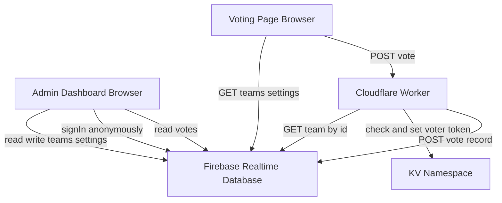
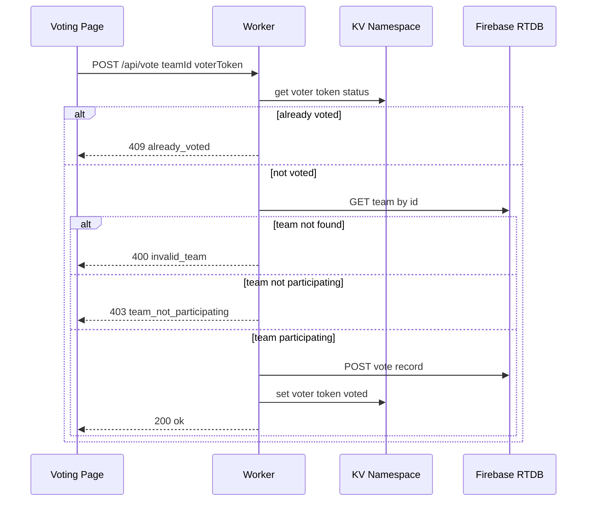
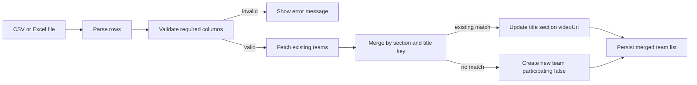

# Design Document

## Overview
本機能は、audience-vote-appのチームデータに参加確定フラグ(`participating`)を導入し、運営担当者が事前に全チーム（本戦確定12チーム＋落選候補）をCSV登録した上で、当日は管理画面のチェックボックス操作だけで各チームを投票対象に組み込めるようにする。あわせて、この機能が実運用で意味を持つための前提として、投票データ未保存・Firebase Auth不整合・二重投票防止未実効・管理者パスワード公開という既存の本番稼働阻害要因を解消する。

**Users**: 運営担当者（管理画面利用者）が事前登録・当日切替・集計確認に利用し、来場者（投票者）が投票画面で参加確定チームのみを閲覧・投票する。

**Impact**: 既存のチームデータ構造・CSV取込処理・投票画面表示ロジック・Cloudflare Workerの`/api/vote`処理・Firebase Realtime Databaseのセキュリティルールを変更する。新規ファイル・新規モジュールは追加しない。

### Goals
- 運営担当者が参加フラグの切替だけで当日の敗者復活枠追加を完結できる
- 投票画面・集計が本戦チームと敗者復活枠チームを区別せず同列に扱う
- 投票データが確実にFirebaseへ永続化され、不正・無効な投票が拒否される
- 2026/9/12の本審査開始までに本番Cloudflare Workers環境で確実に動作する

### Non-Goals
- 本戦確定チームと敗者復活枠チームの見た目上の区別表示
- 部門賞・総合グランプリなど、オーディエンス賞以外の審査ロジック
- 投票結果のリアルタイム反映（`.on('value')`によるライブ更新）
- 独自ドメイン設定、CI/CD自動化、テスト基盤（Jest等）の新設

## Boundary Commitments

### This Spec Owns
- チームデータの`participating`フィールド（スキーマ・デフォルト値・更新経路）
- CSV/Excel取込のupsertロジック（既存チームの更新／新規チームの追加）
- 管理画面における参加フラグの表示・切替UI
- 投票画面における参加確定チームのみの表示フィルタ
- Cloudflare Workerの`/api/vote`におけるteamId実在検証・参加フラグ検証・投票データ永続化
- Firebase Realtime Databaseのセキュリティルール（`teams`/`settings`/`votes`）と、それに整合する管理画面側の認証呼び出し
- 二重投票防止のためのKV namespaceバインド設定
- 管理者ログイン認証情報の変更

### Out of Boundary
- 部門賞・総合グランプリの判定ロジック（審査員採点。本システムのスコープ外）
- 投票画面のリアルタイム更新（ページ再読み込みなしの反映は本specでは扱わない）
- Firebase Authの本格的なメール/パスワード認証への置き換え（将来検討事項。本specでは匿名認証によるルール整合のみ対応）
- チーム情報の削除・編集専用UI（取込・参加切替以外の管理操作）

### Allowed Dependencies
- 既存のFirebase Realtime Database構成（`audienceApp/teams`, `audienceApp/votes`, `audienceApp/settings`）
- 既存のCloudflare Workers + Wrangler構成（`wrangler.jsonc`, `worker.js`）
- Firebase RTDBの公開REST API（`https://<project>-default-rtdb.firebaseio.com/...json`）。Firebase Admin SDK・サービスアカウントは使用しない
- 既存のxlsx.js（CDN）によるCSV/Excelパース処理

### Revalidation Triggers
- `audienceApp/teams`のデータ構造（フィールド追加・削除）を変更する場合
- `firebase.rules.json`の`.write`/`.read`条件を変更する場合
- `/api/vote`のリクエスト/レスポンス契約を変更する場合
- Workerの実行環境変数（`FIREBASE_DB_URL`）の追加・削除

## Architecture

### Existing Architecture Analysis
現行アーキテクチャは、ブラウザから直接Firebase Realtime Databaseへ読み書きするクライアント主導型と、投票の二重防止のみを担う薄いCloudflare Worker API（`/api/vote`）を組み合わせた構成。本specはこのパターンを維持し、Workerの責務を「二重投票防止」から「二重投票防止＋teamId/参加フラグ検証＋投票データ永続化」へ拡張する。新しいアーキテクチャパターンは導入しない。

### Architecture Pattern & Boundary Map

**Architecture Integration**:
- Selected pattern: クライアント直結DB + 薄いAPIサーバーのハイブリッド（現行踏襲）
- Domain/feature boundaries: チーム参加状態の読み書きはクライアント（Admin Dashboard）が担い、投票の検証・永続化はWorkerが担う。二重責務を避けるため、投票の書き込み経路はWorker経由の1本に統一する（Voting PageがRTDBへ直接votesを書き込むことはしない）
- Existing patterns preserved: Firebase compat SDKによるクライアント直結、Cloudflare WorkersのAssetsバインディングによる静的配信
- New components rationale: なし（既存コンポーネントの拡張のみ）
- Steering compliance: 新規モジュール禁止・Firebase Admin SDK禁止の制約を遵守

### Technology Stack

| Layer | Choice / Version | Role in Feature | Notes |
|-------|------------------|-----------------|-------|
| Frontend | Vanilla JS (既存) | 参加フラグUI、投票フィルタ | フレームワーク導入なし |
| Backend | Cloudflare Workers (`worker.js`) | teamId/参加フラグ検証、投票永続化 | Fetch APIのみ、Admin SDK不使用 |
| Data / Storage | Firebase Realtime Database | チーム・投票・設定の永続化 | 既存構成を維持、ルールのみ変更 |
| Data / Storage | Cloudflare KV (`AUDIENCE_VOTES`) | 投票者トークンの重複防止 | 新規バインド追加（既存コード内で参照済み） |
| Infrastructure | Wrangler (`wrangler.jsonc`) | 環境変数・KVバインド定義 | `vars.FIREBASE_DB_URL`を追加 |

## File Structure Plan

新規ファイルは作成しない。既存ファイル内の関数追加・修正のみで実装する。

### Modified Files
- `admin.js` — `DEFAULT_TEAMS`に`participating: true`追加、`mergeTeams`関数新設、CSV取込ハンドラのupsert化、`validateRows`の`participating`列パース対応、`renderGlobalResults`への参加フラグチェックボックス追加、チェックボックス変更ハンドラ追加、ログイン処理への`signInAnonymously()`追加
- `admin.html` — `global-results-body`のテーブルヘッダに参加列を追加、`firebase-auth-compat.js`のscriptタグ追加
- `app.js` — `DEFAULT_TEAMS`に`participating: true`追加、`readTeams()`に参加フラグフィルタを追加
- `worker.js` — `getTeam`関数・`recordVote`関数を新設、`/api/vote`ハンドラにteamId検証・参加フラグ検証・投票永続化呼び出しを追加
- `firebase.rules.json` — `teams`/`settings`の`.write`を`true`に緩和、`votes`の`.read`を`auth != null`のまま維持
- `wrangler.jsonc` — `vars.FIREBASE_DB_URL`を追加、`kv_namespaces`に`AUDIENCE_VOTES`のバインドを追加
- `firebase-config.js` — 実際のFirebaseプロジェクト値へ置換、`audienceDemoAdmin`のパスワードを変更

## System Flows

### 投票受付フロー

**Key decisions**: KVの二重投票チェックを最初に行うことで既存の挙動を維持しつつ、teamId/参加フラグ検証をその後段に追加する。投票記録の永続化に成功した後でKVに投票済みフラグを立てることで、Firebase書き込み失敗時に「投票済み」扱いにしてしまう事故を防ぐ。

### CSV/Excel取込フロー（upsert）

## Requirements Traceability

| Requirement | Summary | Components | Interfaces | Flows |
|-------------|---------|------------|------------|-------|
| 1.1-1.3 | チーム参加状態の管理 | Team Management Service | Team data model | - |
| 2.1-2.4 | CSV/Excel upsert取込 | Team Management Service (Admin Dashboard) | uploadForm handler | CSV/Excel取込フロー |
| 3.1-3.3 | 参加状態の当日切替 | Admin Dashboard | 参加フラグチェックボックス | - |
| 4.1-4.3 | 投票画面の表示フィルタ | Voting Page | readTeams filter | - |
| 5.1-5.2 | オーディエンス賞集計 | Admin Dashboard | renderGlobalResults, determineWinner | - |
| 6.1-6.4 | 投票データの受付・検証 | Voting API | POST /api/vote | 投票受付フロー |
| 7.1-7.2 | 二重投票防止 | Voting API | KV namespace | 投票受付フロー |
| 8.1-8.2 | 管理操作の書き込み整合性 | Admin Dashboard, Data Store Rules | signInAnonymously, firebase.rules.json | - |
| 9.1-9.2 | 管理者認証情報の保護 | Admin Dashboard | ログインフォーム | - |

## Components and Interfaces

| Component | Domain/Layer | Intent | Req Coverage | Key Dependencies (P0/P1) | Contracts |
|-----------|--------------|--------|--------------|--------------------------|-----------|
| Team Management Service | Admin (admin.js) | チームデータのupsertと参加状態管理 | 1, 2, 3 | Firebase RTDB (P0) | State |
| Admin Dashboard | Admin (admin.js/admin.html) | 参加フラグUI、集計表示、ログイン | 3, 5, 8, 9 | Team Management Service (P0), Firebase Auth (P1) | State |
| Voting Page | Frontend (app.js/index.html) | 参加確定チームの表示、投票送信 | 4, 8 | Voting API (P0), Firebase RTDB (P1) | State |
| Voting API | Worker (worker.js) | teamId/参加検証、投票永続化、二重投票防止 | 6, 7 | Firebase RTDB REST (P0), KV Namespace (P0) | API |

### Admin (admin.js)

#### Team Management Service

| Field | Detail |
|-------|--------|
| Intent | CSV/Excel取込のupsertマージと参加フラグの永続化 |
| Requirements | 1.1, 1.2, 1.3, 2.1, 2.2, 2.3, 2.4, 3.3 |

**Responsibilities & Constraints**
- チームの一意性は`section`+`title`の正規化キーで判定する（タイトル変更時は別チーム扱いになる制約を許容）
- 新規チームの`participating`はCSVで明示指定がない限り`false`
- 既存チームの`participating`はCSV再取込時に上書きしない（当日設定済みのON状態を保護する）

**Dependencies**
- Outbound: Firebase Realtime Database（`audienceApp/teams`）— 読み書き (P0)
- Outbound: localStorage（Firebase未設定時のフォールバック）— 読み書き (P1)

**Contracts**: State [x]

##### State Management
- State model: `{ id, title, section, videoUrl, participating }`の配列
- Persistence & consistency: Firebase使用時はキー単位の`update()`、localStorage使用時はJSON配列の置換書き込み
- Concurrency strategy: アップロード直前に最新状態を再取得してからマージすることで、他の管理操作との競合を最小化する（厳密な排他制御は本specのスコープ外）

#### Admin Dashboard

| Field | Detail |
|-------|--------|
| Intent | 参加フラグの切替UI、集計表示、ログイン認証 |
| Requirements | 3.1, 3.2, 5.1, 5.2, 8.1, 9.1, 9.2 |

**Responsibilities & Constraints**
- 全体集計テーブルの各行に参加フラグの切替コントロールを表示する
- 切替操作は個別行の状態のみを更新し、テーブル全体を再描画しない
- ログイン処理はFirebase使用時に匿名認証を実行してからログイン状態を確定する

**Dependencies**
- Outbound: Team Management Service (P0)
- Outbound: Firebase Auth（`signInAnonymously`）(P1)

**Contracts**: State [x]

### Frontend (app.js)

#### Voting Page

| Field | Detail |
|-------|--------|
| Intent | 参加確定チームのみの一覧表示と投票送信 |
| Requirements | 4.1, 4.2, 4.3, 8.2 |

**Responsibilities & Constraints**
- `readTeams()`取得後、`participating === true`のチームのみを描画対象に絞り込む
- 参加状態が未定義のチームは表示しない（安全側のデフォルト）
- 投票受付が停止中の場合はフォーム操作を無効化する（既存動作を維持）

**Dependencies**
- Outbound: Voting API（`POST /api/vote`）(P0)
- Outbound: Firebase Realtime Database（`audienceApp/teams`, `audienceApp/settings`）読み取り (P1)

**Contracts**: State [x]

### Worker (worker.js)

#### Voting API

| Field | Detail |
|-------|--------|
| Intent | 投票リクエストのteamId/参加状態検証、二重投票防止、投票データ永続化 |
| Requirements | 6.1, 6.2, 6.3, 6.4, 7.1, 7.2 |

**Responsibilities & Constraints**
- Firebase Admin SDK・サービスアカウントを使用せず、公開REST APIへのfetchのみで完結する
- `FIREBASE_DB_URL`が未設定の実行環境（ローカル`wrangler dev`等）では検証をスキップし後方互換を維持する
- 二重投票チェック（KV/メモリMap）を最初に行い、その後teamId/参加検証、最後に投票永続化とKVフラグ確定の順で処理する

**Dependencies**
- Outbound: Firebase RTDB REST API（`GET /audienceApp/teams/{id}.json`, `POST /audienceApp/votes.json`）(P0)
- Outbound: Cloudflare KV（`AUDIENCE_VOTES`）(P0)

**Contracts**: API [x]

##### API Contract
| Method | Endpoint | Request | Response | Errors |
|--------|----------|---------|----------|--------|
| POST | /api/vote | `{ teamId, voterToken }` | `{ ok: true, teamId, voterToken }` | 400 invalid_request, 400 invalid_team, 403 team_not_participating, 409 already_voted, 400 invalid_json |

## Data Models

### Logical Data Model

**Team（`audienceApp/teams/{id}`）**

| Field | Type | Notes |
|-------|------|-------|
| id | string | Firebase自動キーまたはUUID |
| title | string | アプリ名 |
| section | string | `life` \| `work` \| `local` |
| videoUrl | string | 紹介動画URL |
| participating | boolean | 参加確定フラグ。デフォルト`false` |

**Vote（`audienceApp/votes/{autoId}`）**

| Field | Type | Notes |
|-------|------|-------|
| teamId | string | 投票先チームID |
| voterToken | string | 投票者トークン（端末単位） |
| votedAt | number | 投票日時（epoch ms） |

### Data Contracts & Integration
- CSV/Excel入力: `section`, `title`, `video_url`（必須）、`participating`（任意、`true`/`1`/`on`/`yes`で真、それ以外は無視）
- Firebase RTDBセキュリティルール: `teams`/`settings`の`.write`を`true`に緩和、`votes`の`.read`のみ`auth != null`を維持（`.write`は既存どおり`true`）

## Error Handling

### Error Strategy
既存のエラーハンドリング方針（`showMessage`によるUI表示、Workerの`Response.json`によるステータスコード返却）を踏襲する。

### Error Categories and Responses
- **User Errors**: 必須列欠如のCSV → 取込エラーメッセージ表示（既存の`validateRows`を拡張）
- **Business Logic Errors**: 存在しない/未参加チームへの投票 → Worker側で400/403を返却し、投票フォームにエラー表示
- **System Errors**: Firebase REST APIへのfetch失敗 → Workerは既存の二重投票防止フォールバック（KV/メモリMap）を維持しつつ、投票永続化失敗時はエラーレスポンスを返す

## Testing Strategy

### Default sections
- Unit Tests: `mergeTeams`のupsertロジック（新規追加・既存更新・participating非上書き）、`validateRows`の`participating`列パース、Worker`getTeam`のteamId不正文字チェック
- Integration Tests: CSV再取込後も既存参加フラグが保持されること、`/api/vote`のteamId検証→参加検証→永続化の一連の流れ、二重投票防止（KVあり/なし両方）
- E2E/UI Tests: 管理画面でチェックボックスON→投票画面（別タブ再読み込み）に反映、投票受付ON/OFFの反映
- 本specはテスト基盤（Jest等）を新設しないため、上記は`npm start`によるlocalStorageモードでの手動確認、および`wrangler dev`での手動確認として実施する

## Security Considerations
- Firebase `apiKey`はブラウザ配布前提の公開情報であり、アクセス制御はセキュリティルールで行う（`teams`/`settings`書き込みの`auth != null`要件を`true`に緩和する判断は、匿名認証を追加しても実質的なセキュリティ向上にならないという前提に基づく）
- `votes`の読み取りのみ`auth != null`を維持し、投票結果を投票中の一般来場者に見せない目的で使う
- 管理者ログインはクライアントJSの単純比較のまま変更しないが、デモ用の`admin`/`admin123`は本番公開前に必ず変更する（Requirement 9）
- Worker側のteamId検証で英数字・ハイフン・アンダースコア以外の文字を早期に拒否し、Firebase REST APIへの不正なパスインジェクションを防ぐ
