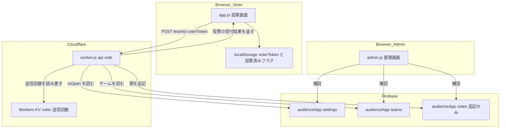
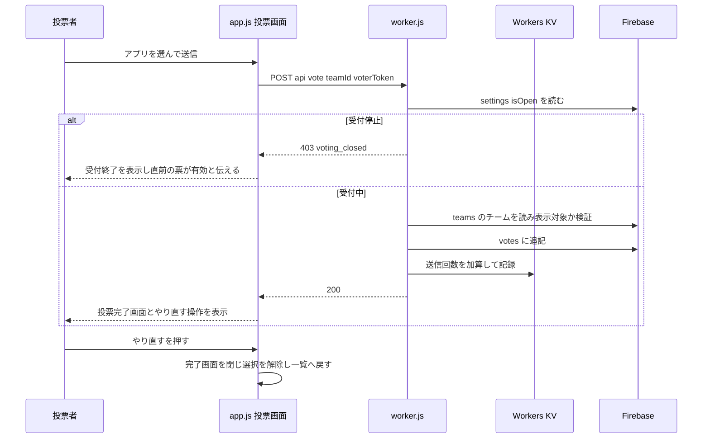
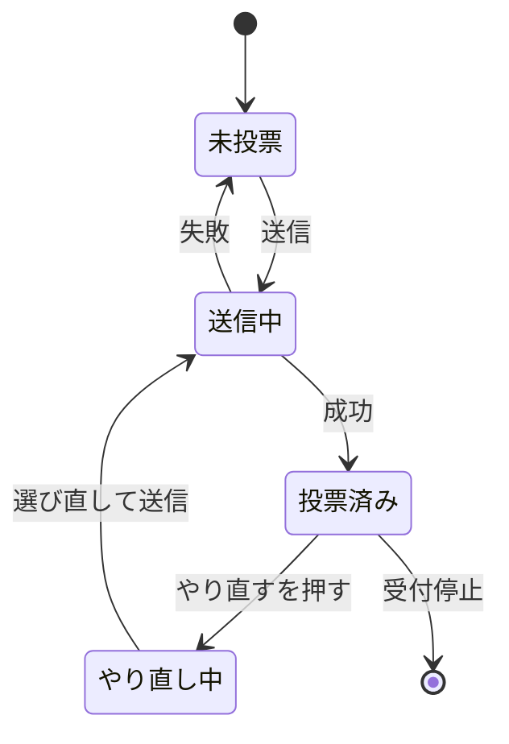

# Technical Design

## Overview

**Purpose**: 本機能は、投票受付が開いている間に限り、投票者が自分の投票を何度でもやり直せるようにする。

**Users**: オーディエンス投票の来場者（投票者）が投票完了画面から利用する。運営担当者は管理画面で、やり直しを織り込んだ正しい集計結果を参照する。

**Impact**: 票の保存先である Firebase Realtime Database のセキュリティルール（追記のみ許可・削除と上書き禁止）は変更しない。票は従来どおり追記され、**管理画面の集計時に同一投票者の最新1件だけを有効票として選ぶ**ことで、投票者から見た「やり直し」を実現する。あわせて Cloudflare Worker の `/api/vote` に受付状態の検証を追加する。

### Goals

- 投票完了画面から投票をやり直し、アプリ一覧で選び直して再送信できる
- 受付中は回数の上限なくやり直せる
- やり直しの回数にかかわらず、得票数が常に「1投票者あたり1票」になる
- 投票受付が停止された後は、クライアント・サーバーの双方でやり直しを成立させない
- 過去の投票記録を削除も変更もしない

### Non-Goals

- やり直し回数の上限。本仕様では設けない
- 投票記録に保存される `voterToken` の秘匿化（ハッシュ化）。既知のリスクとして受容する
- 管理画面からの個別の票の取り消し・編集
- 投票受付状態の投票画面へのリアルタイム反映（画面を開いたまま締め切られた場合の即時反映）
- ページを再読み込みした後のやり直し。再読み込み後は従来どおり「投票済み」としてロックされ、直前の票が有効なまま残る
- 別の端末・別のブラウザからのやり直し
- 票の物理削除およびセキュリティルールの変更

## Boundary Commitments

### This Spec Owns

- `/api/vote` のリクエスト検証・応答契約（受付状態の検証を含む）
- KV キー `voter:{voterToken}` の値の意味（「その投票者の送信回数の記録」。投票を拒否する判定には使わない）
- 投票画面における投票フェーズの遷移（未投票 → 送信中 → 投票済み → やり直し中 → 送信中 …）と、投票完了画面のやり直し操作
- 管理画面における**有効票の決定規則**（同一 `voterToken` の最新1件のみを有効とする）と、その結果を用いた集計・無効票件数の提示
- 上記に伴う投票画面・管理画面の表示要素の追加

### Out of Boundary

- `audienceApp/teams` のデータ構造、および表示対象チームの判定規則（`isVisibleTeam`）。既存のまま利用する
- `audienceApp/settings` の書き込み（投票受付の開始・停止操作）。既存の管理画面の責務のまま
- `firebase.rules.json` の内容。本仕様は一切変更しない
- 管理者認証、チーム登録手順（`scripts/team-patch.mjs`）、資産配信設定（`.assetsignore`）
- `voterToken` の生成方式および端末間での同一性の担保

### Allowed Dependencies

- Cloudflare Workers KV バインディング `AUDIENCE_VOTES`（既存）
- Worker 環境変数 `FIREBASE_DB_URL`（既存の secret）
- Firebase Realtime Database の `audienceApp/settings`（読み取りのみ）、`audienceApp/teams`（読み取りのみ）、`audienceApp/votes`（追記のみ）
- ブラウザの `localStorage`（キー `audience-vote-token`・`audience-vote-submitted`・`audienceApp:*`）
- 依存の向き: `worker.js` はクライアント側スクリプトに依存しない。`app.js` と `admin.js` は互いに依存しない。共有が必要な判定規則はファイル間で複製し、既存の `isVisibleTeam` と同じコメント規約で同期対象であることを明示する

### Revalidation Triggers

以下が変わる場合、投票画面・管理画面・Worker の三者を再確認する。

- `/api/vote` の成功応答に含まれるフィールドの追加・削除・意味の変更
- `/api/vote` のエラーコード（`voting_closed` など）の追加・改名
- KV キー `voter:{voterToken}` の値の形式（送信回数の10進文字列）の変更
- `audienceApp/votes` のレコード項目（`teamId`・`voterToken`・`votedAt`）の変更
- 有効票の決定規則（`votedAt` 降順 → プッシュキー降順）の変更
- やり直し回数の上限を導入する場合

## Architecture

### Existing Architecture Analysis

- **配信構成**: Cloudflare Workers Static Assets 1本。`worker.js` が `/api/vote` を処理し、それ以外は `env.ASSETS` へ委譲する。ビルド工程はなく、`app.js`・`admin.js`・`worker.js` はいずれも素のスクリプト。モジュール共有の仕組みを持たない。
- **既存の重複の扱い**: `isVisibleTeam` は3ファイルに同一コードで複製され、「3か所で揃える判定規則」というコメントで同期対象が明示されている。本設計もこの慣習に従う。
- **二段構えのフォールバック**: 接続設定（`firebase-config.js`）が未構成の場合、投票画面・管理画面はともに `localStorage` で完結するデモモードに落ちる。本設計はデモモードでも同等の挙動を保つ。
- **投票画面の接続方針**: 起動時に `settings` と `teams` を1回だけ読み、直後に `db.goOffline()` する。常時接続を持たない方針のため、受付状態の変化はクライアントでは検知できない。
- **管理画面の接続方針**: `teams`・`votes`・`settings` を `on('value')` で購読し、変化のたびに再集計する。
- **既存の技術的負債**: `/api/vote` は受付状態（`isOpen`）を検証していない。本設計でこれを塞ぐ。

### Architecture Pattern & Boundary Map



**Architecture Integration**:

- **採用パターン**: 追記専用ログ（append-only log）＋ 読み取り時の最新レコード選択（read-time reduction）。書き込み側の制約を変えずに「上書き」の意味論を実現する。
- **責務の分離**: 「送信を受け付けてよいか」は Worker が唯一の権威を持つ。「どの票が有効か」は管理画面の集計が唯一の権威を持つ。投票画面は状態を保持せず、Worker の応答と `localStorage` の表示用フラグだけで画面を駆動する。
- **維持する既存パターン**: 判定規則のファイル間複製＋同期コメント、デモモードのフォールバック、投票画面の非常時接続方針。
- **新規コンポーネントの根拠**: 有効票の選定（`selectEffectiveVotes`）は集計の正しさを一点に集約するために独立させる。ここを通さない集計経路を作らないことが、二重計上を防ぐ唯一の担保になる。

### Technology Stack

| Layer | Choice / Version | Role in Feature | Notes |
|-------|------------------|-----------------|-------|
| Frontend | 素の ES2020（バンドラなし） | 投票画面のやり直しUI・状態遷移、管理画面の有効票選定と集計 | 新規依存なし。`app.js`・`admin.js`・`vote.css`・`admin.html` を変更 |
| Backend / Services | Cloudflare Workers（`worker.js`）／ wrangler 4.x | `/api/vote` の受付状態検証・回数制限・票の追記 | 新規依存なし |
| Data / Storage | Firebase Realtime Database（compat SDK 10.12.2）／ Cloudflare Workers KV | 票の追記保存／投票者ごとの送信回数 | **スキーマ変更なし**。KV は値の意味のみ拡張 |
| Infrastructure / Runtime | Cloudflare Workers Static Assets | 既存のまま | 新たな secret・バインディングの追加は不要 |

## File Structure Plan

### Modified Files

- `worker.js` — `/api/vote` に受付状態の検証と送信回数の上限判定を追加し、成功応答に残りやり直し回数を含める。KV の値を送信回数として読み書きする。
- `app.js` — 投票完了画面へのやり直し操作の追加、やり直し時の状態リセット、残りやり直し回数の保持と表示、新しいエラーコードの出し分け、デモモードでの同等挙動。
- `vote.css` — 投票完了画面のやり直しボタンと残り回数表示のスタイル。
- `admin.js` — 有効票の選定処理を追加し、集計の入口を有効票に一本化する。votes 購読をプッシュキー保持に変更。無効票件数を提示する。
- `admin.html` — 無効票（やり直しにより無効になった票）の件数を示す表示要素を追加。

### 新規ファイル

なし。既存ファイルの変更のみで完結する。

## System Flows

### 投票とやり直しのフロー



**Key Decisions**:

- 受付状態の検証を最初に行い、締め切り後の書き込みを一切発生させない。
- KV への回数記録は票の追記に**成功した後**に行う。この値は投票を拒否する判定には使わない。

### 投票画面の状態遷移



**Key Decisions**:

- 「やり直し中」は未投票と同じ操作可能状態であり、内部的に区別せず `hasVoted = false` に戻すことで表現する。これにより既存の送信経路をそのまま再利用できる。
- 送信失敗時は選択状態を保ったまま未投票へ戻し、選び直して再送信できるようにする（1.6）。

## Requirements Traceability

| Requirement | Summary | Components | Interfaces | Flows |
|-------------|---------|------------|------------|-------|
| 1.1 | 受付中の完了画面にやり直す操作を出す | VoteCompletionOverlay | `renderDoneOverlay` | 投票とやり直し |
| 1.2 | 完了画面を閉じて一覧に戻す | VoteFlowController | `enterRedoMode` | 状態遷移 |
| 1.3 | 戻した際は未選択にする | VoteFlowController | `enterRedoMode` | 状態遷移 |
| 1.4 | 再送信は初回と同じ手順 | VoteFlowController | 既存の submit ハンドラ | 投票とやり直し |
| 1.5 | 同一投票者として扱う | VoteFlowController / VoteSubmissionApi | `getVoterToken`（再生成禁止） | 投票とやり直し |
| 1.6 | 送信失敗時は選び直せる状態を保つ | VoteFlowController | `handleSubmitFailure` | 状態遷移 |
| 2.1 | やり直し回数に上限を設けない | VoteSubmissionApi | 回数による拒否を行わない | 投票とやり直し |
| 2.2 | 受付中は常にやり直す操作を出す | VoteCompletionOverlay | `canRedo` | 状態遷移 |
| 2.3 | 回数にかかわらず得票は1件 | EffectiveVoteSelector | `selectEffectiveVotes` | — |
| 3.1 | 受付停止中は操作を出さない | VoteCompletionOverlay | `appState.isOpen` | 状態遷移 |
| 3.2 | 停止中の送信は記録せず通知 | VoteSubmissionApi / VotingStatusGuard | 403 `voting_closed` | 投票とやり直し |
| 3.3 | 拒否時は直前の票が有効と伝える | VoteFlowController | `applyVotedUiState` | 状態遷移 |
| 3.4 | 停止中は新規送信も受け付けない | VoteFlowController / VotingStatusGuard | 既存 `isLocked` ＋ 403 | 投票とやり直し |
| 4.1 | 同一投票者の最新1件のみ計上 | EffectiveVoteSelector | `selectEffectiveVotes` | — |
| 4.2 | 無効票はどの得票にも数えない | EffectiveVoteSelector | `selectEffectiveVotes` | — |
| 4.3 | 別アプリへのやり直しで増減する | EffectiveVoteSelector / VoteAggregator | `computeVoteCounts` | — |
| 4.4 | 同じアプリへのやり直しで不変 | EffectiveVoteSelector / VoteAggregator | `computeVoteCounts` | — |
| 4.5 | 総投票数は有効票の件数 | VoteAggregator | `renderGlobalResults` | — |
| 4.6 | 無効票の件数を区別して示す | VoteAggregator | `renderGlobalResults` | — |
| 4.7 | 再読み込みなしで更新 | VoteAggregator | 既存の `on('value')` 購読 | — |
| 4.8 | 部門別・順位・同票・受賞判定も有効票のみ | VoteAggregator | `renderAggregates` | — |
| 4.9 | チーム不一致の票は従来どおり集計対象外 | VoteAggregator | `computeVoteCounts` | — |
| 5.1 | 過去の票を削除も変更もしない | VoteSubmissionApi | `recordVote`（追記のみ） | 投票とやり直し |
| 5.2 | 投票者と時刻を記録する | VoteSubmissionApi | `recordVote` | 投票とやり直し |
| 5.3 | 追記のみのルールを維持 | —（`firebase.rules.json` 無変更） | — | — |
| 5.4 | 有効票を一意に決定できる | EffectiveVoteSelector | `selectEffectiveVotes`（2段キー） | — |
| 6.1 | 得票に反映されるのは常に1件 | EffectiveVoteSelector | `selectEffectiveVotes` | — |
| 6.2 | やり直し操作を経ない連続送信も同じ扱い | VoteSubmissionApi / EffectiveVoteSelector | 送信経路は単一 | 投票とやり直し |
| 6.3 | 拒否理由を示す | VoteFlowController | エラーコードの出し分け | 状態遷移 |

## Components and Interfaces

> 本プロジェクトはビルド工程を持たない素の ES2020 で書かれている。以下の型表記は契約を明示するための記述であり、実装は JSDoc 注釈付きの JavaScript とする。境界（HTTP リクエスト本文・KV の値・DB から読んだ値）では実行時に型を検証する。

| Component | Domain/Layer | Intent | Req Coverage | Key Dependencies (P0/P1) | Contracts |
|-----------|--------------|--------|--------------|--------------------------|-----------|
| VoteSubmissionApi | Backend（`worker.js`） | `/api/vote` の検証・記録・応答 | 2.1, 3.2, 5.1, 5.2, 6.2 | KV `AUDIENCE_VOTES`（P0）, `FIREBASE_DB_URL`（P0） | API, State |
| VotingStatusGuard | Backend（`worker.js`） | 受付状態のサーバー側検証 | 3.2, 3.4 | Firebase `settings`（P0） | Service |
| VoteAttemptCounter | Backend（`worker.js`） | 投票者ごとの送信回数の記録 | 5.2 | KV `AUDIENCE_VOTES`（P0） | Service, State |
| VoteFlowController | Frontend（`app.js`） | 投票フェーズの遷移とエラーの出し分け | 1.2, 1.3, 1.4, 1.5, 1.6, 3.3, 3.4, 6.3 | VoteSubmissionApi（P0） | State |
| VoteCompletionOverlay | Frontend（`app.js` / `vote.css`） | 完了画面のやり直し操作 | 1.1, 2.2, 3.1 | VoteFlowController（P0） | — |
| EffectiveVoteSelector | Frontend（`admin.js`） | 同一投票者の最新票の選定 | 2.3, 4.1, 4.2, 5.4, 6.1, 6.2 | — | Service |
| VoteAggregator | Frontend（`admin.js` / `admin.html`） | 有効票に基づく集計と件数の提示 | 4.3〜4.9 | EffectiveVoteSelector（P0） | Service |

### Backend（`worker.js`）

#### VoteSubmissionApi

| Field | Detail |
|-------|--------|
| Intent | `/api/vote` の唯一の入口として、受付状態とチームを検証し、票を追記する |
| Requirements | 2.1, 3.2, 5.1, 5.2, 6.2 |

**Responsibilities & Constraints**

- 検証の順序を固定する: リクエスト形式 → 設定の存在 → **受付状態** → チームの表示対象判定 → 票の追記 → 送信回数の記録。
- 送信回数による拒否は行わない（2.1）。受付中である限り、同一投票者からの送信を何度でも受け付ける。
- 票の追記は常に新規レコードの追加であり、既存レコードの更新・削除を行わない（5.1）。
- `voterToken` はリクエストで受け取った値をそのまま使い、サーバー側で生成・変換しない。

**Dependencies**

- External: Cloudflare Workers KV `AUDIENCE_VOTES` — 送信回数の保存（P0）
- External: Firebase Realtime Database REST — `settings`・`teams` の読み取り、`votes` への追記（P0）

**Contracts**: Service [ ] / API [x] / Event [ ] / Batch [ ] / State [x]

##### API Contract

| Method | Endpoint | Request | Response | Errors |
|--------|----------|---------|----------|--------|
| POST | `/api/vote` | `VoteRequest` | `VoteAccepted` | 400, 403, 500 |

```typescript
interface VoteRequest {
  teamId: string;      // 空文字不可。/^[A-Za-z0-9_-]+$/ に一致すること
  voterToken: string;  // 空文字不可
}

interface VoteAccepted {
  ok: true;
  teamId: string;
  voterToken: string;
}

interface VoteRejected {
  error: VoteErrorCode;
}

type VoteErrorCode =
  | 'invalid_request'        // 400: teamId または voterToken が空
  | 'invalid_json'           // 400: 本文が JSON として解釈できない
  | 'invalid_team'           // 400: 指定されたチームが存在しない
  | 'team_not_participating' // 403: 表示対象外のチーム
  | 'voting_closed'          // 403: 投票受付が停止している（新規）
  | 'server_misconfigured'   // 500: KV バインディングまたは DB URL が未設定
  | 'settings_fetch_failed'  // 500: 受付状態の読み取りに失敗（新規）
  | 'team_fetch_failed'      // 500: チームの読み取りに失敗
  | 'vote_write_failed';     // 500: 票の追記に失敗
```

- **Preconditions**: `env.FIREBASE_DB_URL` と `env.AUDIENCE_VOTES` が設定されていること。
- **Postconditions**: 200 を返した場合に限り、`audienceApp/votes` にレコードが1件増えている。それ以外の応答では増えない。
- **Invariants**: 同一 `voterToken` の複数の票のうち、集計に反映されるのは常に1件である（EffectiveVoteSelector が保証する）。

##### State Management

- **State model**: KV キー `voter:{voterToken}` の値は、その投票者がこれまでに成功させた送信回数の10進文字列。**記録であり、投票を拒否する判定には使わない。**
- **Persistence & consistency**: TTL は 30日（既存どおり）。上書き時にも毎回付け直す。既存レコードの `'1'` は「1回送信済み」として解釈され、移行作業を必要としない。
- **Concurrency strategy**: 値は判定に使わないため、並行送信による数え落としが起きても集計結果に影響しない。

**Implementation Notes**

- Integration: 既存の `getTeam` / `recordVote` はそのまま利用する。`already_voted` を返していた 409 の分岐は削除する。
- Validation: リクエスト本文は既存どおり文字列化と空判定を行う。KV から読んだ値は `Number.parseInt(value, 10)` し、数値でない場合は 0 として扱う。
- Risks: 上限がないため、`votes` に保存された生の `voterToken` を収集した第三者が、他人の票を受付中に何度でも書き換えられる。Security Considerations 参照。

#### VotingStatusGuard

| Field | Detail |
|-------|--------|
| Intent | 投票受付が開いているかをサーバー側で判定する |
| Requirements | 3.2, 3.4 |

**Responsibilities & Constraints**

- `audienceApp/settings/isOpen` を読み、真偽値として解釈する。
- 値が `null`（未設定）の場合は「受付中」とみなす。既存のクライアント側の既定値と揃える。
- 読み取りに失敗した場合は投票を通さず 500 を返す。受付停止中の票が紛れ込むより、投票者に再試行を促すほうが安全である。

**Contracts**: Service [x] / API [ ] / Event [ ] / Batch [ ] / State [ ]

##### Service Interface

```typescript
// 受付中なら true。読み取りに失敗した場合は 'settings_fetch_failed' を投げる
function isVotingOpen(env: Env): Promise<boolean>;
```

- **Preconditions**: `env.FIREBASE_DB_URL` が設定されていること。
- **Postconditions**: Firebase の状態を変更しない（読み取りのみ）。

#### VoteAttemptCounter

| Field | Detail |
|-------|--------|
| Intent | 投票者ごとの送信回数を KV に記録する |
| Requirements | 5.2 |

**Responsibilities & Constraints**

- 送信回数は**記録のみ**であり、投票を拒否する判定には一切使わない。
- この記録を残すことで、運用中に澫用が見つかった場合に上限を再導入できる余地を保つ。

**Contracts**: Service [x] / API [ ] / Event [ ] / Batch [ ] / State [x]

##### Service Interface

```typescript
// これまでに成功した送信回数。未投票なら 0
function readAttemptCount(env: Env, voterToken: string): Promise<number>;

// 送信回数を指定値で保存し直す（TTL 30日を付け直す）
function writeAttemptCount(env: Env, voterToken: string, count: number): Promise<void>;
```

- **Invariants**: `readAttemptCount` の戻り値は 0 以上の整数。KV に不正な値が入っていた場合も 0 として扱う。

### Frontend（`app.js` / `vote.css`）

#### VoteFlowController

| Field | Detail |
|-------|--------|
| Intent | 投票フェーズの遷移を管理し、送信結果に応じて画面状態とメッセージを決める |
| Requirements | 1.2, 1.3, 1.4, 1.5, 1.6, 3.3, 3.4, 6.3 |

**Responsibilities & Constraints**

- やり直し操作では `voterToken` を**再生成しない**（1.5）。`localStorage` の `audience-vote-token` には一切触れない。
- やり直し操作では投票済みフラグ（`audience-vote-submitted`）を削除し、`hasVoted = false`・`selectedId = null` に戻す（1.2, 1.3）。既存の送信経路をそのまま再利用する（1.4）。
- 送信が拒否された場合、理由ごとに画面状態を分ける（6.3）:
  - `voting_closed` → 投票済み状態に戻し、「受付は終了しました。直前の投票が有効です」と示す（3.3）
  - その他の失敗 → 未投票状態に戻し、選択を保ったまま再送信できるようにする（1.6）

**Dependencies**

- Outbound: VoteSubmissionApi — 投票の送信（P0）

**Contracts**: Service [ ] / API [ ] / Event [ ] / Batch [ ] / State [x]

##### State Management

```typescript
interface VoteAppState {
  isOpen: boolean;
  teams: Team[];
  hasVoted: boolean;
  selectedId: string | null;
  phase: 'idle' | 'sending';
}
```

- **State model**: 「やり直し中」は独立した状態を持たず、`hasVoted = false` かつ完了画面が閉じている状態として表現する。
- **Persistence**: やり直し回数に上限がないため、回数に関する状態をクライアントで保持しない。ページ再読み込み後はやり直し操作を提示しない（Non-Goals）。

**Implementation Notes**

- Integration: 既存の submit ハンドラの「投票済みなら弾く」分岐は残す。やり直し操作がフラグを消すため、やり直し中は自然に通過する。
- Validation: サーバー応答のエラーコードで分岐する（403 は受付終了と表示対象外チームの双方で使うため、ステータスだけでは区別できない）。
- Risks: 完了画面を表示したままページを再読み込みするとやり直せなくなる。直前の票は有効なまま残るため集計は壊れない。

#### VoteCompletionOverlay

| Field | Detail |
|-------|--------|
| Intent | 投票完了画面にやり直す操作を提示する |
| Requirements | 1.1, 2.2, 3.1 |

**Responsibilities & Constraints**

- やり直す操作を描画する条件は `appState.isOpen === true` のときのみ（1.1, 2.2, 3.1）。回数による出し分けは行わない。
- 条件を満たさない場合はボタン自体を描画せず、完了画面は従来どおりの内容とする。
- 受付中は何度でも選び直せる旨をボタンに併記する。

**Implementation Notes**

- Integration: 既存の `showDoneOverlay(title)` 内でやり直しブロックを組み立てる。`vote.css` に `.done-redo` 系のクラスを追加し、既存の `.done-card` と同じ配色トークンを用いる。
- Validation: ボタンのラベルは固定文字列とし、DBから来た値（アプリ名）は既存の `escapeHtml` を通す。
- Risks: なし（表示のみ）。

### Frontend（`admin.js` / `admin.html`）

#### EffectiveVoteSelector

| Field | Detail |
|-------|--------|
| Intent | 記録された全票から、投票者ごとに有効な1票を選び出す |
| Requirements | 2.3, 4.1, 4.2, 5.4, 6.1, 6.2 |

**Responsibilities & Constraints**

- 同一 `voterToken` の票のうち、`votedAt` が最大のものを有効票とする。`votedAt` が同値の場合はレコードのキー（Firebase のプッシュキーは時系列で単調増加する）の辞書順が大きいものを有効票とする（5.4）。
- `voterToken` を持たない票は、他のいずれの票とも同一視せず、そのまま1件の有効票として扱う（過去データに対する安全側の挙動）。
- 選ばれなかった票の件数を「やり直しにより無効になった票」として返す（4.6）。
- **集計に使う票は必ずこの関数を通す。** 通さない集計経路を作らないことが二重計上を防ぐ唯一の担保である。

**Contracts**: Service [x] / API [ ] / Event [ ] / Batch [ ] / State [ ]

##### Service Interface

```typescript
interface VoteRecord {
  key: string;          // Firebase のプッシュキー。デモモードでは配列の添字を文字列化した値
  teamId: string;
  voterToken?: string;
  votedAt?: number;
}

interface EffectiveVotes {
  votes: VoteRecord[];    // 投票者ごとに1件だけを含む
  supersededCount: number; // やり直しにより無効になった票の件数
}

function selectEffectiveVotes(records: VoteRecord[]): EffectiveVotes;
```

- **Preconditions**: `records` は記録された全票。順序は問わない。
- **Postconditions**: `votes.length + supersededCount === records.length`。`votes` の中に同じ `voterToken` は2件以上現れない。
- **Invariants**: 入力を変更しない（純粋関数）。

**Implementation Notes**

- Integration: `admin.js` の votes 購読を `Object.values(...)` から `Object.entries(...).map(([key, vote]) => ({ key, ...vote }))` に変更し、プッシュキーを保持する。デモモード（`localStorage` の配列）では添字を `key` として付与する。
- Validation: `votedAt` が数値でない票は `-Infinity` として扱い、同一投票者の中で最も古いものとみなす。
- Risks: `votedAt` はサーバー（Worker）が付与するためクライアント時刻に左右されないが、デモモードではブラウザの時刻に依存する。デモモードは動作確認用途に限るため許容する。

#### VoteAggregator

| Field | Detail |
|-------|--------|
| Intent | 有効票に基づいて各集計表示を更新する |
| Requirements | 4.3, 4.4, 4.5, 4.6, 4.7, 4.8, 4.9 |

**Responsibilities & Constraints**

- `renderAggregates` の入口で `selectEffectiveVotes` を1度だけ呼び、その結果を部門別集計・全体集計・オーディエンス賞判定のすべてに渡す（4.8）。個々の描画関数は有効票のみを受け取る前提とし、内部で再度の絞り込みを行わない。
- 総票数には有効票の件数を表示する（4.5）。
- 無効票の件数が1件以上のとき、有効票と区別できる形で併記する（4.6）。0件のときは表示しない。
- どのチームにも一致しない票の扱いは従来どおりとし、有効票の中から数える（4.9）。

**Dependencies**

- Inbound: Firebase `votes`・`teams` の購読、またはデモモードの再描画（P0）
- Outbound: EffectiveVoteSelector — 有効票の選定（P0）

**Contracts**: Service [x] / API [ ] / Event [ ] / Batch [ ] / State [ ]

##### Service Interface

```typescript
// 既存シグネチャを維持しつつ、votes には有効票のみが渡される
function computeVoteCounts(
  teams: Team[],
  effectiveVotes: VoteRecord[]
): { countsById: Map<string, number>; excludedCount: number; totalVotes: number };
```

- **Postconditions**: `totalVotes` は有効票の件数。`countsById` の総和と `excludedCount` の和が `totalVotes` に一致する。

**Implementation Notes**

- Integration: `admin.html` の総票数を示す段落に、無効票件数を示す要素を1つ追加する（既存の `excluded-note` と同じ体裁）。
- Validation: 既存の順位付け（`assignRanks`）・同票判定（`determineWinner`）は入力が有効票に置き換わるだけで、ロジックの変更を要しない（4.3, 4.4, 4.8）。
- Risks: 有効票への絞り込みを経由しない集計経路が追加されると二重計上が起きる。レビュー時の重点確認項目とする。

## Data Models

### Domain Model

- **投票者（Voter）**: `voterToken` によって識別される。集計上の単位であり、常に有効票を高々1件持つ。
- **投票（Vote）**: 追記専用のレコード。`{ teamId, voterToken, votedAt }` を持つ。作成後に変更されない。
- **有効票（Effective Vote）**: 投票者ごとに、`votedAt` とレコードキーで決まる最後の1件。導出値であり永続化しない。
- **不変条件**:
  - 投票レコードは作成後に削除・変更されない
  - 1投票者あたりの有効票は常に 1 件（投票レコードが1件以上ある場合）

### Logical Data Model

**`audienceApp/votes/{pushKey}`（変更なし）**

| Attribute | Type | Notes |
|-----------|------|-------|
| `teamId` | string | 投票先のチームID |
| `voterToken` | string | 投票者の識別子。同一投票者のやり直しでも同じ値 |
| `votedAt` | number | Worker が付与する UNIX ミリ秒 |

スキーマは変更しない。有効票の判定に必要な情報はすべて既存項目で足りる。

**Workers KV `voter:{voterToken}`（値の意味を変更）**

| 変更前 | 変更後 |
|--------|--------|
| 固定文字列 `'1'`（投票済みを示すフラグ。二重投票の拒否に使用） | 送信回数の10進文字列（記録のみ。拒否には使用しない） |

TTL は 30日で据え置く。既存値 `'1'` は「1回送信済み」として矛盾なく解釈されるため、データ移行は不要。

### Data Contracts & Integration

- `/api/vote` の成功応答の形は変わらない（`{ ok, teamId, voterToken }`）。
- 409 `already_voted` の応答がなくなる。受付中は同一トークンからの送信が常に 200 になる。
- 403 `voting_closed` が新規に加わる。クライアントはステータスではなくエラーコードで分岐する。

## Error Handling

### Error Strategy

投票の拒否は「投票者が次に取れる行動」が変わる単位で区別する。サーバーは機械可読なコードを返し、投票者向けの文言はクライアントが組み立てる。

### Error Categories and Responses

**User Errors (4xx)**

| 状況 | コード | HTTP | 投票画面の挙動 |
|------|--------|------|----------------|
| チームIDまたはトークンが空 | `invalid_request` | 400 | 汎用の失敗メッセージを示し、未投票状態を保つ |
| チームが存在しない | `invalid_team` | 400 | 同上 |
| 表示対象外のチーム | `team_not_participating` | 403 | 同上 |
| 受付が停止している | `voting_closed` | 403 | 投票済み状態に戻し、受付終了と直前の票が有効である旨を示す（3.3） |

**System Errors (5xx)**

| 状況 | コード | 投票画面の挙動 |
|------|--------|----------------|
| KV または DB URL が未設定 | `server_misconfigured` | 失敗メッセージを示し、未投票状態に戻して再送信できるようにする |
| 受付状態の読み取り失敗 | `settings_fetch_failed` | 同上 |
| チームの読み取り失敗 | `team_fetch_failed` | 同上 |
| 票の追記失敗 | `vote_write_failed` | 同上。票は記録されていない |

### Monitoring

追加の監視基盤は導入しない。障害時は既存どおり `npx wrangler tail` で `/api/vote` の応答コードを確認する（`docs/DEPLOY.md` 5章）。`voting_closed` は正常系の拒否であり、頻出しても異常ではない。

## Testing Strategy

本プロジェクトは自動テスト基盤を持たない。既存スペックと同じく、ローカル Worker（`npx wrangler dev --persist-to /tmp/...`）に対する `curl` 検証とブラウザでの手動確認を正とする。

### API Tests（`curl` による `/api/vote` の検証）

1. 同一 `voterToken` で連続送信（例: 6回）→ すべて 200 になり、回数による拒否が起きない（2.1）
2. 受付停止（`settings.isOpen = false`）にした状態で送信 → 403 `voting_closed` となり、`votes` にレコードが増えない（3.2）
3. 受付を戻すと同じ送信が 200 になる（3.2）
4. 送信後に `votes` を確認 → 過去のレコードが削除・変更されていない（5.1）
5. `firebase.rules.json` に差分がない（5.3）

### E2E / UI Tests（ブラウザ手動確認）

1. 投票 → 完了画面にやり直す操作が表示される → 押すと一覧に戻り、どのアプリも選択されていない（1.1, 1.2, 1.3, 2.2）
2. 別のアプリを選んで再送信 → 完了画面が再表示され、やり直す操作も引き続き表示される（1.4, 2.2）
3. やり直しを4回以上繰り返す → 拒否されず、都度完了画面が表示される（2.1）
4. 管理画面で受付を停止した後に投票画面をリロード → 完了画面にやり直す操作が表示されない（3.1）
5. 完了画面を開いたまま管理画面で受付を停止し、やり直して再送信 → 受付終了のメッセージが出て、直前の票が有効である旨が示される（3.2, 3.3, 6.3）

### Integration Tests（管理画面の集計）

1. 2台の端末で別々のアプリに投票 → 総票数2、各アプリ1票（既存挙動の非退行）
2. 1台がやり直して別のアプリへ投票 → 前のアプリが1減り、新しいアプリが1増える。総票数は2のまま、無効票1件が併記される（4.3, 4.5, 4.6）
3. 1台がやり直して同じアプリへ投票 → 得票数が変わらず、総票数も2のまま、無効票が1件増える（4.4）
4. 1台が5回以上やり直す → 有効票は常に1件のままで、総票数が増えない（2.3, 6.1, 6.2）
5. やり直しを挟んで同票の状態を作る → オーディエンス賞候補が「同票」として両チームを示す（4.8）
6. 投票中に管理画面を開いたまま集計が更新される（再読み込み不要）（4.7）
7. 存在しないチームIDの票を混ぜる → 従来どおり集計対象外として件数のみ示される（4.9）

### Demo Mode Tests（接続設定なしでの確認）

1. デモモードで何度でもやり直せる（2.1 相当）
2. デモモードの管理画面で、やり直し後の集計が Firebase モードと同じ結果になる（4.1〜4.6）

## Security Considerations

- **セキュリティルールを変更しない**: `firebase.rules.json` は本仕様で一切変更しない。`votes` の「追記のみ許可・削除と上書き禁止」を維持することが、認証を使わない設計における整合性の担保である（5.3）。
- **受付状態のサーバー側検証を追加**: これまでクライアント側のみで行っていた受付停止の判定を `/api/vote` にも入れる（既存の穴の解消）。上限を撤廃したことで、これが投票を拒否する**唯一の**サーバー側の防御線になる。
- **受容する既知のリスク（重要）**: `audienceApp/votes` は誰でも読み取り可能で、`voterToken` が生の値で保存される。**やり直しに回数上限を設けないため、トークンを収集した第三者が他人の票を受付中に何度でも書き換えられる。**以前の二重投票防止や回数上限が果たしていた「被害の上限」は存在しない。社内イベント限定であることを前提に、本仕様ではこのリスクを受容する。緩和する場合は、Worker 側で salt 付きハッシュを保存する別仕様が必要になる。
- **集計バグの影響範囲に上限がない**: 有効票の絞り込みを経由しない集計経路ができると、やり直した回数だけ票が水増しする。`renderAggregates` の入口で一度だけ絞り込む構造を崩さないことを、レビュー時の重点確認項目とする。
- **入力の検証位置**: `teamId` の形式検証（既存の `/^[A-Za-z0-9_-]+$/`）は維持する。KV から読んだ値・DB から読んだ値は、使用前に実行時に型を検証する。

## Migration Strategy

データ移行は不要。

- `audienceApp/votes` のスキーマは変更しない。既存の票はすべて有効票の候補としてそのまま扱われる。
- KV の既存値 `'1'` は新しい解釈（送信回数1）と一致するため、書き換え不要。
- ロールバックは `npx wrangler rollback` で Worker を戻すだけでよい。追記された票はそのまま残り、旧版の集計ロジックでは全票が数えられる（やり直しを行った投票者の票が重複計上される）ため、**ロールバックする場合は本番でやり直しが行われる前に実施する**必要がある。当日運用ではこの点を判断材料とする。
